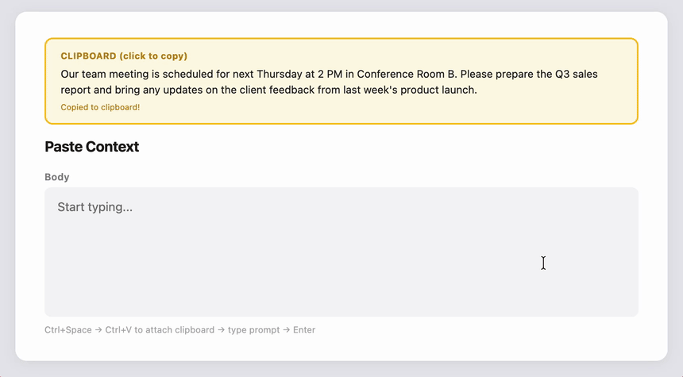

# Hatoko

  

> A macOS IME where keystrokes meet intelligence.

[English](README.md)

Hatoko は macOS 向けの Input Method Engine (IME) です。日本語のかな漢字変換に加え、LLM アシスト入力をサポートします。

## 特徴

- **日本語入力** — ローマ字入力からのかな漢字変換
- **LLM アシスト入力** — Ctrl+Space で LLM による文章生成モードに切り替え
  - インラインサジェスト: 思考アニメーション付きのポップアップでカーソル付近に候補を表示
  - チャットウィンドウ: 対話的に文章を推敲
- **複数の LLM バックエンド** — Claude・OpenAI・Gemini に対応

  | バックエンド | API | CLI |
  |---------------------|-----|-----|
  | Claude              | ❓  | 💻  |
  | OpenAI              | ⚠️  | 💻  |
  | Gemini              | ✅  | 💻  |
  | Apple Intelligence  | ✅  | -   |

  > ✅ 動作確認済み &nbsp; ⚠️ 実験的 &nbsp; ❓ 未検証 &nbsp; 💻 開発目的のみ

  > **Apple Intelligence に関する注記:** オンデバイスの Foundation Models バックエンドは完全にデバイス上で動作し、API キーは不要です。ただし、IME 用途においてはモデルの品質に明らかな限界があります。クラウドベースの LLM と比較して、応答の精度や文脈理解が劣る場合があります。品質よりもプライバシーを重視する場合の選択肢として位置づけてください。

- **Liquid Glass UI** — macOS 26 ネイティブのガラスモーフィズムによるサジェスト・チャットパネル
- **設定画面** — API キー・CLI パスの設定を GUI で管理

## デモ

### 日本語入力

### インラインサジェスト

### チャットウィンドウ

### ペーストコンテキスト

## はじめに

ビルド手順・プロジェクト構成は [CONTRIBUTING.md](CONTRIBUTING.md) を参照してください。

## 使い方

| モード | 切り替え | 説明 |
|--------|----------|------|
| 日本語入力 | デフォルト | ローマ字入力 → かな漢字変換 (Space で変換、Enter で確定) |
| LLM アシスト | Ctrl+Space | プロンプトを入力 → Enter で LLM に送信 → Enter で確定 / Tab でチャットへ |
| ペーストコンテキスト | Ctrl+V (LLM モード中) | クリップボードのテキストを LLM 生成のコンテキストとして添付。再度押すと解除 |

設定画面は入力ソースメニューの Ctrl+クリックから開けます。

## 謝辞

このプロジェクトは以下のオープンソースプロジェクトに大きく支えられています。

### AzooKeyKanaKanjiConverter

Hatoko のかな漢字変換は [AzooKeyKanaKanjiConverter](https://github.com/azooKey/AzooKeyKanaKanjiConverter) を利用しています。macOS / iOS 向けの高品質なかな漢字変換エンジンを OSS として公開してくださっている [azooKey](https://github.com/azooKey) プロジェクトに深く感謝します。

AzooKeyKanaKanjiConverter がなければ、Hatoko がかな漢字変換を実現することは極めて困難でした。変換精度・パフォーマンスの両面で非常に優れたライブラリであり、IME 開発の基盤として不可欠な存在です。

- azooKey — MIT License, Copyright (c) 2020-2023 Keita Miwa (ensan)
- AzooKeyKanaKanjiConverter — MIT License, Copyright (c) 2023 Miwa / Ensan

## ライセンス

MIT License — 詳細は [LICENSE](LICENSE) を参照してください。

依存ライブラリのライセンスについては上記「謝辞」セクションを参照してください。
