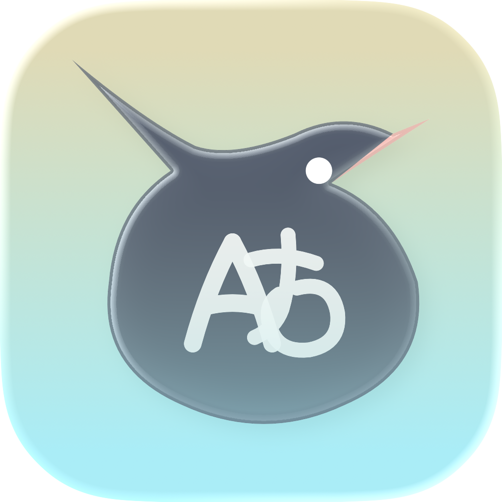
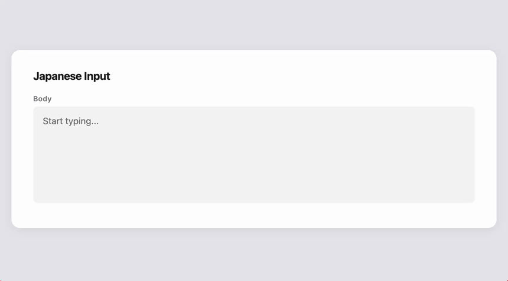
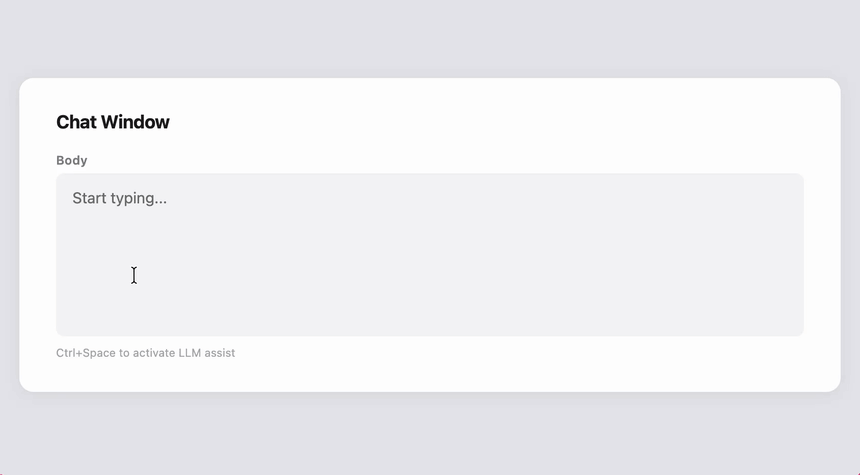

# Hatoko

  

> A macOS IME where keystrokes meet intelligence.

[日本語](README.ja.md)

Hatoko is an Input Method Engine (IME) for macOS. It provides Japanese kana-kanji conversion along with LLM-assisted text input.

## Features

- **Japanese Input** — Kana-kanji conversion from romaji input
- **LLM-Assisted Input** — Switch to LLM-powered text generation with Ctrl+Space
  - Inline suggestion: Popup near cursor with thinking animation and generated candidates
  - Chat window: Iteratively refine text through conversation
- **Multiple LLM Backends** — Claude, OpenAI, and Gemini supported

  | Backend | API | CLI |
  |---------|-----|-----|
  | Claude  | ❓  | ✅  |
  | OpenAI  | ❓  | ⚠️  |
  | Gemini  | ✅  | ✅  |

  > ✅ Verified &nbsp; ⚠️ Experimental &nbsp; ❓ Untested

- **Liquid Glass UI** — Native macOS 26 glass morphism for suggestion and chat panels
- **Settings UI** — Manage API key and CLI path via GUI

## Demo

### Japanese Input

### Inline Suggestion

### Chat Window

## Getting Started

See [CONTRIBUTING.md](CONTRIBUTING.md) for build instructions and project structure.

## Usage

| Mode | Shortcut | Description |
|------|----------|-------------|
| Japanese Input | Default | Romaji input → kana-kanji conversion (Space to convert, Enter to commit) |
| LLM Assist | Ctrl+Space | Type a prompt → Enter to send to LLM → Enter to accept / Tab to open chat |

Open the settings via Ctrl+Click on the input source menu.

## Acknowledgements

This project is built on top of the following open-source project.

### AzooKeyKanaKanjiConverter

Hatoko's kana-kanji conversion is powered by [AzooKeyKanaKanjiConverter](https://github.com/azooKey/AzooKeyKanaKanjiConverter). We are deeply grateful to the [azooKey](https://github.com/azooKey) project for publishing such a high-quality kana-kanji conversion engine as open-source software.

Without AzooKeyKanaKanjiConverter, it would have been extremely difficult for Hatoko to achieve kana-kanji conversion. It is an outstanding library in both accuracy and performance, and serves as an indispensable foundation for IME development.

- azooKey — MIT License, Copyright (c) 2020-2023 Keita Miwa (ensan)
- AzooKeyKanaKanjiConverter — MIT License, Copyright (c) 2023 Miwa / Ensan

## License

MIT License — See [LICENSE](LICENSE) for details.

For dependency licenses, see the Acknowledgements section above.
